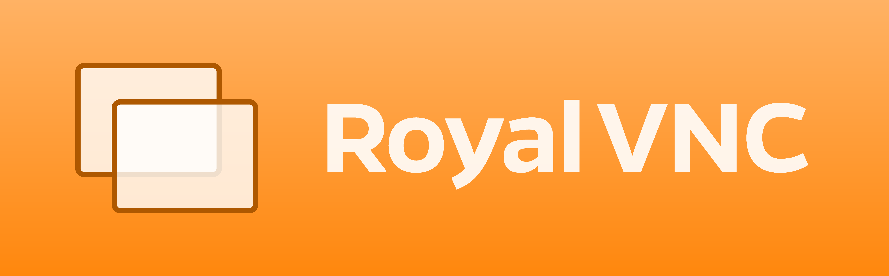

RoyalVNC is a modern, high performance implementation of the [VNC/RFB protocol](https://github.com/rfbproto/rfbproto/blob/master/rfbproto.rst) written in Swift.
The SDK (RoyalVNCKit) is compatible with Swift, Objective-C, C and C# on macOS, iOS, iPadOS, Linux and Windows.
It has no external dependencies but includes some free (public domain) third party code from the libtommath, libtomcrypt and D3DES libraries (see [Credits](#Credits)).

## Supported Features

### Security Types (Authentication Methods)
- No Authentication
- VNC Password
- Apple Remote Desktop
- UltraVNC MS-Logon II

### Encodings
- Zlib
- ZRLE
- Hextile
- CoRRE
- RRE
- CopyRect

### Pseudo Encodings
- LastRect
- CompressionLevel
- DesktopName
- Cursor
- DesktopSize
- ExtendedDesktopSize
- ContinuousUpdates

### Misc. Features
- Support for 8-bit, 16-bit and 24/32-bit color depths with high-performance framebuffer implementations.
- Clipboard redirection support for text in both ways (remote to local and local to remote).
- Connection state management and rendering is decoupled from each other, so it's possible to build "headless" clients (ie. no rendering of the remote desktop).
- The SDK includes a ready-to-use implementation of a framebuffer view for macOS (subclass of `NSView`), which also handles mouse and keyboard input, local cursor (`NSCursor`), scaling and rendering. The iOS/iPadOS equivalent (`UIView`) is a work-in-progress.
- First-class error handling. The `VNCError` type divides all possible errors into three broad categories: Protocol, Authentication and Connection errors. There are helper functions to retrieve human-readable descriptions for all errors and a convenience functions that allows the SDK consumer to distinguish between errors that should be displayed to the user and ones that shouldn't.
- Headless CLI demos (one using Swift and another one using the C API) are included in the repository.
- The repository also contains C# bindings so the library can be used with .NET.
- [This repository](https://github.com/royalapplications/royalvnc-demo) contains Demo/Sample clients for macOS (one written in Swift, one in Objective-C) and iOS/iPadOS.

## Usage
See [Usage](USAGE.md).

## License
[MIT License](LICENSE)

## Credits
- [libtommath](https://github.com/libtom/libtommath) ([The LibTom license](https://github.com/libtom/libtommath/blob/develop/LICENSE))
- [libtomcrypt](https://github.com/libtom/libtomcrypt) ([The LibTom license](https://github.com/libtom/libtomcrypt/blob/develop/LICENSE))
- [zlib](https://github.com/madler/zlib) ([zlib license](https://github.com/madler/zlib/blob/develop/LICENSE))
- D3DES (Public Domain, Copyright Richard Outerbridge)
